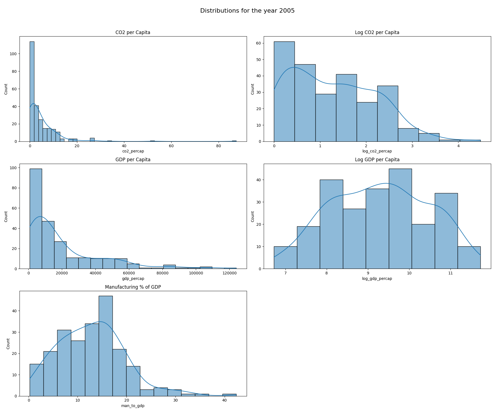
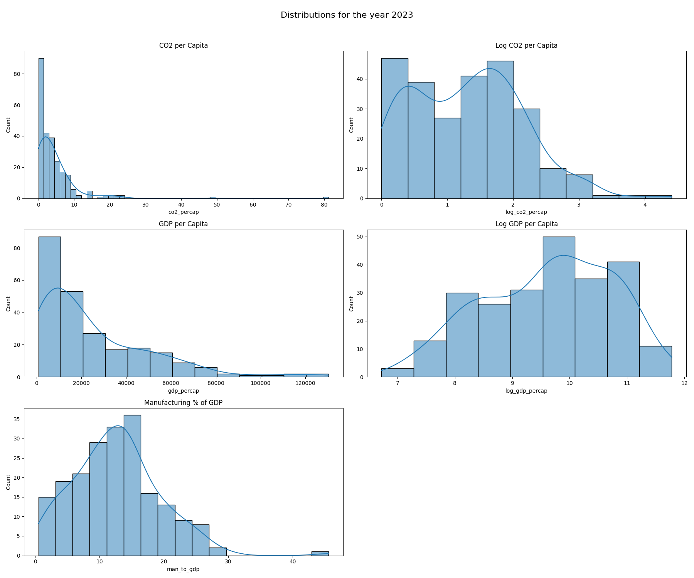
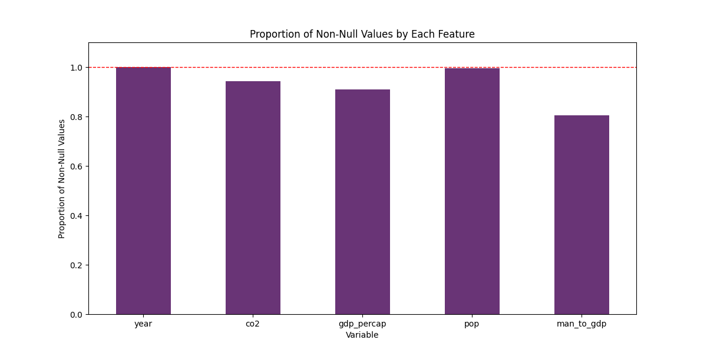
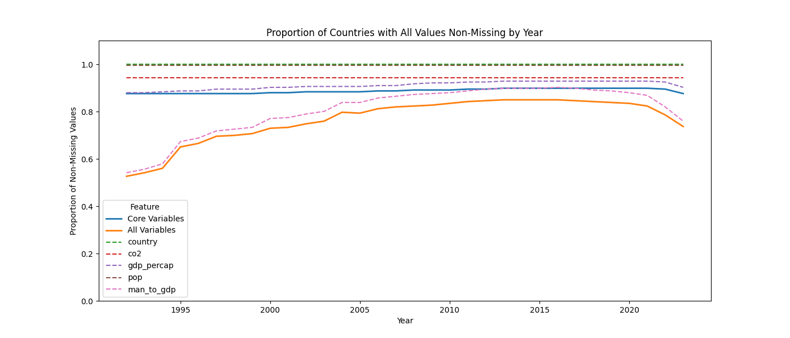
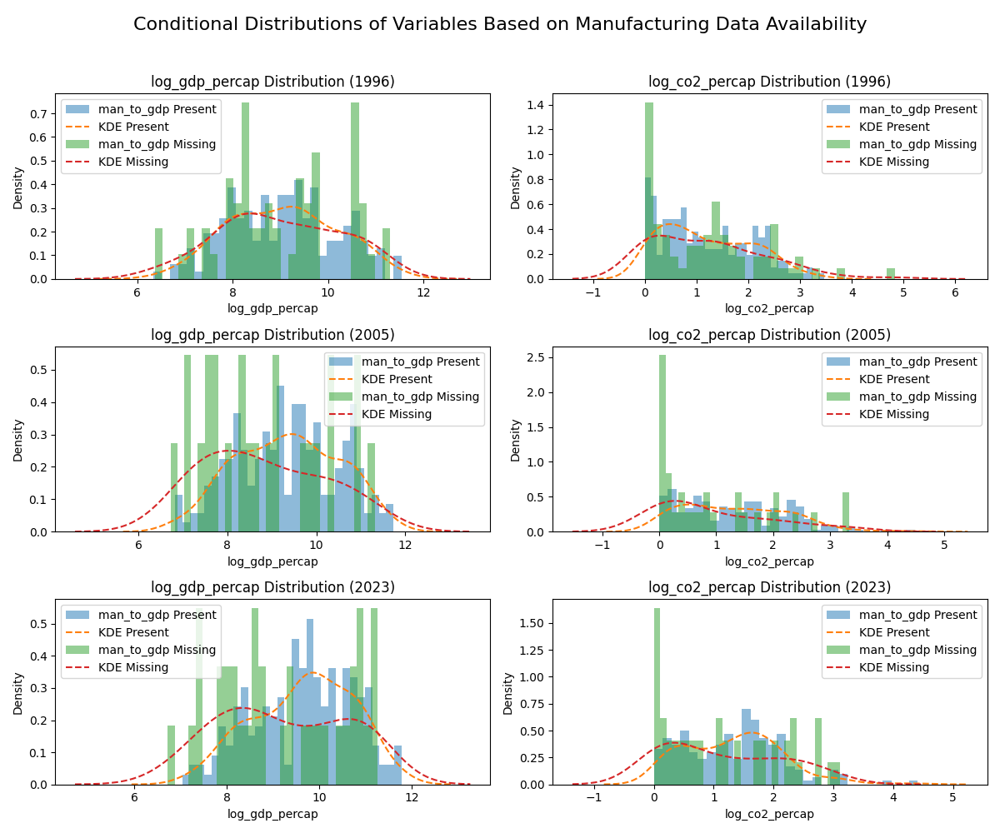
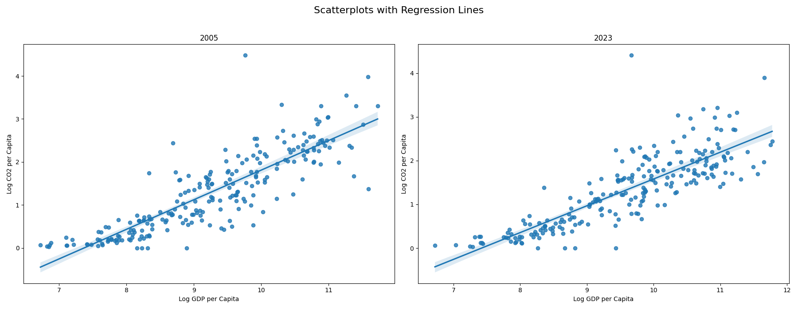

# Analysing the relationship between CO2 emissions and GDP per capita and assessing the level of industrualization as a potential confounder
Author: István Járay
Course: Data Analysis 4 @CEU
Lecturer: Gábor Békés
CEUID: 2104062

# 1. Introduction
In the following assignment, I analyze the potential country-level relationship between CO2 emissions and GDP. 

The source of the dataset is the World Bank Development Indicators, accessed through a python sdk called wbgapi

The variables in the source database are:
- GDP per capita, PPP (constant 2021 international $)
  - International dollar expresses a PPP-based conversion of all local currencies to the US dollar.
-  Carbon dioxide (CO2) emissions (total) excluding LULUCF (Mt CO2e)
   -  LULUCF expresses forest-fire related emissions
   -  This is not per capita, I address this in my data preprocessing
   -  All values are expressed in Million tons. In order for my log transformations to work, I will later transform them into tons (achieved by multiplying by a million)
- Total population
- Manufacturing, value added (% of GDP)
  - The GDP is the total domestic value added.
    - I hope to gauge how industry or service-centric an economy is by expressing the ratio of the manufacturing sector's added value to this total.
  - This is the confounder variable.

## 1.1 Expectations
I expect, that the GDP per capita and the level of CO2 emissions will show signs of a positive relationship
- Higher levels of GDP per capita might correlate with a higher level of economic activity. This could lead to higher levels of CO2 emissions.

However, I expect, that the level of industrialization will be a common cause confounder:
- I assume, that the more industrialized an economy is, the higher it's CO2 output will be.
- However I also assume, that the highest GDP-per-capita is observed among those economies, which are service-centric. This could indicate a negative relationship between the level of industrialization and the GDP per capita.
- If the chosen variable gauges this effect correctly, and the assumptions hold, then in a simple OLS setting, ommitting it could lead to overestimating the effect of GDP per capita.

# 2. Describing the data
When working with a panel dataset, it is important to assess data coverage over all periods. Hence, I discuss the descriptive statistics separately, in a cross-section to assume a functional form (whether logs could/should be applied). Then, I follow with assessing data coverage over multiple periods.

## 2.1 Descriptive Statistics
I include descriptive statistics for both 2005 and 2023, as I  include those specific years in the cross-sectional OLS regressions.
I introduced logs of GDP per capita and CO2 emissions. In Figure 1 and Figure 2, I compared the distributions of the variables before and following the log transformation. Table 1 and 2 contains the descriptive statistics.
- GDP per capita seems to be close to log-normal: following the log transformation, the resulting variable is unimodal and symmetric in both time periods
- The CO2 per capita remains left-skewed, and in the case of 2023, two moduses are apparent. However, the log-transformation could be beneficial due to the large differences in observed levels.
- However, the log transformation might not be beneficial for the Manufacturing % of GDP.

As a result, I chose the logs of GDP per capita and CO2 emissions per capita for the analysis. However, the Manufacturing % of GDP is included without log transformation.

## 2.2 Analysis of coverage and ommission practice
I analyze the coverage of the data for the time-series regressions. The goal is to only keep those countries in the dataset, which have data available for all time periods for all variables.
Generally, over all time periods, the Manufacturing % of GDP seems to have the lowest coverage, still at 80%. (Figure 3). GDP per capita and CO2 emissions have a coverage of around 90%.

Introducing the time dimension, however, yields a less promising finding. (Figure 4) The coverage of the Manufacturing % of GDP seems to be around 50% around 1992. From around 2002 until 2020 however, we can see a higher coverage of around 75-80%. The total coverage without this varable seems to revolve steadily around 85-90%.

As a result, I decided to create two subsets of the data:
- The first subset spans the entire timeframe and ommits all countries that has any missing values of GDP per capita or CO2 emissions. I will refer to this subset as the *core subset*.
- The second subset spans only from 2002 until 2020 to provide higher coverage. Compared to the *core subset*, this also includes the confounding variable as a basis for omission criteria.

The question naturally arises, whether this filtering introduces biases to our dataset. In Figure 5, I compared the conditional distributions of the log of GDP per capita and the log of CO2 emissions per capita. There may be a systematic bias: Less developed countries appear to have more missing data on manufacturing ratio reported.
- Contrary to expectations, this difference appears to be more pronounced in 2005 and 2023 than in 1996.
  - The disparity could mean that richer countries adopted the reporting of this measure more successfully.
- Hence, our findings could be biased - limiting the strength of the estimated relationship between a country's wealth and CO2.

The list of countries ommitted can be found in Table 3 and 4. Thirty four countries are ommitted from the core subset and seventy six are ommitted from the reduced subset including the confounding variable.

A minor detail is, that before filtering, all variables were inputed by country with the average of the directly preceding or following year's observations, if there was only one year missing.

# 3. Analysis
## 3.1 Primary analysis
In this chapter, I introduce six parametric estimation models. In each case, the dependent variable is the level of CO2 emissions per capita, and the explanatory variable is the level of GDP per capita. 

The first two models are cross-sectional OLS models on 2005 (model 1) and 2023 (model 2) respectively. This first glimpse will yield us an overview on the general relationship between CO2 emissions and GDP within a country.

Then, I introduce three first difference models: one withut lags (model 3), one with lags up to two years (model 4) and one with lags up to 6 years (model 5). In all cases, I include time-period dummies. The first difference (FD) model allows us to introduce time dimension to our analysis in a specific manner: by estimating the *"effects"* of shocks at a given time. Furthermore, introducing lags of the first differences helps us to gauge lasting effects and compunding effects of shocks. In other words, FD models estimate the relationship between *changes* of the dependent and *changes* of the explanatory (or other confounding) variables.

Finally, I introduce a fixed effect model (FE) with time and country fixed effects (model 6). Controlling for time and contry fixed effects, a FE model can similarly be used to estimate stochastic relationships as FD. The setup is however different, as we are not modelling changes, but relationships in *"demeaned"* variances. *(Demeaned in the sense, that country-level fixed effects take care of the level differences, in time series and time-period specific fixed effects filter general shocks and trends affecting all countries at the same time)*

### 3.1.1 OLS estimations for 2005 and 2023
Table 5 compares the two OLS regressions (model 1 and 2). The coefficient for the OLS regression on the cross-section of 2005 is 0.6883. This can be interpreted as a 1% increase in GDP per capita is associated with a 0.6883% increase in CO₂ emissions per capita. This estimated relationship in elasticities is somewhat smaller in 2023 with a coefficient of 0.621.

Looking at the two scatterplots (Figure 6), it is visible, that the error terms are heterogenous. A higher level of the log of GDP per capita is associated with higher variance. Furthermore, a slight convex relationship can be observed at lower GDP per capita levels. This may be the result of the log transformations. This finding holds for both time periods.

### 3.1.2 First Difference models
Table 6 Compares the Fixed Difference models. 

#### Model 3 - Time Period Dummies
Model 3 runs the regression with Δ log(CO₂ per capita) as the dependent variable and Δ log(GDP per capita) as the eplanatory variable. Model 3 also includes Time trend dummies. 

In this setup, the model only captures immediate effects of changes in GDP per Capita on CO2 emissions. Time series dummies filter out those confounding factors, wich would influence all countries at the same time period. Hence, the estimated coefficient captures the remaining relationship between the two variables.

The coefficient is 0.653, which indicates that in a given year, a 1% higher difference in GDP per capita is associated with a 0.653% higher difference in CO₂ per capita holding the time period constant.

#### Model 4&5 - Introducing lags
Introducing the lags of the first differences yields us the possibility filter out the effects of long-lasting shocks from the immediate change. Although the immediate relationship weakened, none of the lags had a significant coefficient estimation.

Introducing lags up to two years, the coefficient of the concurrent difference reduced to 0.292. Introducing lags up to 6 years however, increased the coefficient to 0.326. I believe the fact, that the window of observation shrinked might be a contributing factor to this unexpected behaviour.

#### Robustness analysis with Country-level intercepts
Country-level intercepts in a FD model filter the differences in individual trends, further specifying the effects of shocks. In the current implementation, the general intercept is not ommitted, but is rendered meaningless nonetheless. What matters is the controlling behavior.

Table 7 compares our initial findings in Table 6 with introduced country-level intercepts. In summary, the absolute value of the coefficients either did not change or slightly decreased.

### 3.1.3 Fixed Effects model with time and country fixed effects
The Fixed Effects model contains time and country-specific fixed effects. As discussed above, this eliminates both individual- and time-specific confounders through *demeaning*. What remains is the individual variation after controlling for these factors.

The coefficient of log(GDP per capita) is 0.3653. This can be interpreted as a 1% increase in GDP per capita is associated with a 0.365% increase in CO₂ per capita, holding all country-specific and time-specific fixed effects constant. In other words, after accounting for the differences between countries in the average log(GDP per capita) for each country, and accounting for the differences between the averages for each time period, the log(GDP per capita) is still associated with a higher level of CO2 emissions per capita.

The *"Within-R^2"* is 

## 3.2 Secondary analysis - including the confounder
As stated before in chapter 2.2, the confounder can only be included for time-series analysis on a stricter, smaller subset of the data used for the analyses above. The timeframe is limited to 2002 and 2020, and all countries are ommitted that have any missing value for log GDP per capita, log CO2 emissions per capita or Manufacturing % of GDP. Hence, due to the different subsets of data, the models are not directly comparable.

Table 8 contains the coefficient estimates for these models. Although the confounder variable's coeficient is in neither of the models significant, log GDP per capita remains in all cases positive and significant. The coefficients in all cases are even larger than without adding the confounders, but due to the differing of data subsets, this might be due to selection bias.

# 4. Conclusion
A consistent finding is, that GDP and CO2 emissions are positively related across all estimation methods. However, the inclusion of the level of industrialization yielded no significant findings, even if the primary relationship remained unaffected. I believe, that the variable chosen as the confounder might not have been the right one to capture this factor, which might be due partially to poor coverage or perhaps because it is not direct enough. The final, Fixed Effect model, which includes country- and time-specific fixed effects, estimates that a 1% increase in GDP per capita is associated with a 0.365% increase in CO₂ per capita holding the fixed effects constant. This accounts for more than an effect window of 2 or 6 years, hence this model is my final result.

# APPENDIX
## Figures
**Figure 1: Comparing log and level distributions of variables in 2005**

---

**Figure 2: Comparing log and level distributions of variables in 2023**

---

**Figure 3: Coverage by features**

---

**Figure 4: Proportion of Countries with Values Non-missing by Year by Variable**

---

**Figure 5: Conditional Distributions of Variables Based on Availability of Data on Manufacturing %**

---

**Figure 6: Model 1 and 2 represented on a scatterplot with a fitted regression line.**

---

## Tables
**Table 1: Descriptive statistics of 2005**

| Year | Variable                                            | Count | Mean       | Median     | Std Dev    | Min      | Max         |
| ---- | --------------------------------------------------- | ----- | ---------- | ---------- | ---------- | -------- | ----------- |
| 2005 | CO2 emissions (Mt CO2e)                             | 251.0 | 1004.9597  | 19.3776    | 3286.1253  | 0.0000   | 30044.5432  |
| 2005 | Manufacturing, value added (% of GDP)               | 223.0 | 12.8525    | 12.5668    | 6.8975     | 0.2326   | 42.4012     |
| 2005 | GDP per capita (PPP, constant 2021 international $) | 241.0 | 20140.1460 | 10527.4748 | 22878.0632 | 830.5092 | 124095.6173 |
| 2005 | Population (millions)                               | 265.0 | 262.7536   | 9.0296     | 827.7919   | 0.0099   | 6575.6443   |
| 2005 | CO2 emissions per capita (tons)                     | 251.0 | 4.8321     | 2.2862     | 8.1465     | 0.0000   | 87.5523     |
| 2005 | Log GDP per capita                                  | 241.0 | 9.2890     | 9.2618     | 1.1746     | 6.7232   | 11.7288     |
| 2005 | Log CO2 emissions per capita                        | 251.0 | 1.2770     | 1.1897     | 0.9322     | 0.0000   | 4.4836      |

Total in 2005: 266

**Table 2: Descriptive statistics of 2023**
| Year | Variable                                            | Count | Mean       | Median     | Std Dev    | Min      | Max         |
| ---- | --------------------------------------------------- | ----- | ---------- | ---------- | ---------- | -------- | ----------- |
| 2023 | CO2 emissions (Mt CO2e)                             | 251.0 | 1423.7028  | 24.1638    | 4807.9239  | 0.0000   | 39023.9370  |
| 2023 | Manufacturing, value added (% of GDP)               | 202.0 | 12.6426    | 12.6125    | 6.7448     | 0.4922   | 45.6045     |
| 2023 | GDP per capita (PPP, constant 2021 international $) | 240.0 | 25513.1676 | 17458.0862 | 25132.5122 | 828.8611 | 130373.4779 |
| 2023 | Population (millions)                               | 265.0 | 328.7886   | 10.6449    | 1018.5895  | 0.0098   | 8061.8760   |
| 2023 | CO2 emissions per capita (tons)                     | 251.0 | 4.4620     | 2.6608     | 7.1655     | 0.0000   | 81.2095     |
| 2023 | Log GDP per capita                                  | 240.0 | 9.6157     | 9.7676     | 1.1256     | 6.7213   | 11.7782     |
| 2023 | Log CO2 emissions per capita                        | 251.0 | 1.2997     | 1.2977     | 0.8439     | 0.0000   | 4.4093      |
Total in 2023: 266

**Table 3: List of ommitted countries based on the core set of variables**
| country                   | log_gdp_percap_missing | co2_percap_missing | log_gdp_percap_avg | co2_percap_avg |
| :------------------------ | :--------------------- | :----------------- | :----------------- | :------------- |
| Afghanistan               | 8                      | 0                  | 7.754922324        | 0.152898568    |
| American Samoa            | 32                     | 0                  |                    | 0.001874733    |
| Andorra                   | 0                      | 32                 | 10.95512089        |                |
| British Virgin Islands    | 32                     | 0                  |                    | 1.730038942    |
| Cayman Islands            | 14                     | 0                  | 11.25973742        | 3.958843445    |
| Channel Islands           | 32                     | 32                 |                    |                |
| Cuba                      | 32                     | 0                  |                    | 2.333789109    |
| Curacao                   | 8                      | 32                 | 10.3535129         |                |
| Djibouti                  | 21                     | 0                  | 8.602280929        | 1.028060375    |
| Eritrea                   | 32                     | 0                  |                    | 0.25222302     |
| Faroe Islands             | 16                     | 0                  | 11.02117712        | 0.039026359    |
| French Polynesia          | 32                     | 0                  |                    | 3.626675926    |
| Gibraltar                 | 32                     | 0                  |                    | 14.42059959    |
| Greenland                 | 2                      | 0                  | 10.84712496        | 6.344057712    |
| Guam                      | 32                     | 0                  |                    | 0.001779658    |
| Isle of Man               | 32                     | 32                 |                    |                |
| Korea, Dem. People's Rep. | 32                     | 0                  |                    | 2.863984017    |
| Kosovo                    | 16                     | 32                 | 9.200605052        |                |
| Liechtenstein             | 32                     | 32                 |                    |                |
| Monaco                    | 32                     | 32                 |                    |                |
| Montenegro                | 5                      | 32                 | 9.85283933         |                |
| New Caledonia             | 32                     | 0                  |                    | 13.16935103    |
| Northern Mariana Islands  | 32                     | 0                  |                    | 0              |
| Not classified            | 32                     | 32                 |                    |                |
| San Marino                | 5                      | 32                 | 11.09472076        |                |
| Serbia                    | 3                      | 32                 | 9.681871103        |                |
| Sint Maarten (Dutch part) | 17                     | 32                 | 10.77437852        |                |
| South Sudan               | 32                     | 32                 |                    |                |
| St. Martin (French part)  | 32                     | 32                 |                    |                |
| Turks and Caicos Islands  | 19                     | 0                  | 10.13726001        | 1.500344597    |
| Venezuela, RB             | 32                     | 0                  |                    | 5.271315165    |
| Virgin Islands (U.S.)     | 11                     | 0                  | 10.82968459        | 0.001857901    |
| West Bank and Gaza        | 2                      | 32                 | 8.529183933        |                |
| Yemen, Rep.               | 32                     | 0                  |                    | 0.691480512    |

**Table 4: List of ommitted countries based on the subsetting including the confounder**
| country                                     | log_gdp_percap_missing | co2_percap_missing | man_to_gdp_missing | log_gdp_percap_avg | co2_percap_avg | man_to_gdp_avg |
| :------------------------------------------ | :--------------------- | :----------------- | :----------------- | :----------------- | :------------- | :------------- |
| American Samoa                              | 19                     | 0                  | 19                 |                    | 0.001846368    |                |
| Andorra                                     | 0                      | 19                 | 0                  | 11.02666842        |                | 3.632720832    |
| Armenia                                     | 0                      | 0                  | 10                 | 9.298861733        | 1.671620413    | 10.46933407    |
| Aruba                                       | 0                      | 0                  | 1                  | 10.53856544        | 4.129437163    | 4.315381714    |
| Bahrain                                     | 0                      | 0                  | 4                  | 10.89275307        | 24.73497826    | 15.74594397    |
| Bermuda                                     | 0                      | 0                  | 4                  | 11.52317774        | 3.858306082    | 0.875845955    |
| British Virgin Islands                      | 19                     | 0                  | 19                 |                    | 1.980746364    |                |
| Bulgaria                                    | 0                      | 0                  | 19                 | 9.972101593        | 6.715117642    |                |
| Burundi                                     | 0                      | 0                  | 4                  | 6.838296857        | 0.040084507    | 10.07725483    |
| Cayman Islands                              | 4                      | 0                  | 4                  | 11.26348732        | 3.939685313    | 0.828336281    |
| Central African Republic                    | 0                      | 0                  | 7                  | 7.106601449        | 0.052776616    | 19.25904254    |
| Channel Islands                             | 19                     | 19                 | 14                 |                    |                | 0.806179029    |
| China                                       | 0                      | 0                  | 2                  | 9.244908629        | 6.61197477     | 30.28970111    |
| Comoros                                     | 0                      | 0                  | 19                 | 8.090908756        | 0.255685427    |                |
| Cuba                                        | 19                     | 0                  | 0                  |                    | 2.38090123     | 14.28809245    |
| Curacao                                     | 0                      | 19                 | 0                  | 10.36570143        |                | 7.121055361    |
| Djibouti                                    | 11                     | 0                  | 11                 | 8.55703817         | 0.81817874     | 3.107128904    |
| East Asia & Pacific                         | 0                      | 0                  | 2                  | 9.535970745        | 5.634346964    | 23.91521172    |
| East Asia & Pacific (IDA & IBRD countries)  | 0                      | 0                  | 2                  | 9.221760413        | 5.1569931      | 28.8775321     |
| East Asia & Pacific (excluding high income) | 0                      | 0                  | 2                  | 9.210318406        | 5.123359465    | 28.86830248    |
| Equatorial Guinea                           | 0                      | 0                  | 4                  | 10.23512038        | 4.586985119    | 19.20602211    |
| Eritrea                                     | 19                     | 0                  | 11                 |                    | 0.208837537    | 7.135844019    |
| Faroe Islands                               | 6                      | 0                  | 0                  | 10.99282813        | 0.040123737    | 5.858674493    |
| Fragile and conflict affected situations    | 0                      | 0                  | 19                 | 8.573582289        | 1.157544448    |                |
| French Polynesia                            | 19                     | 0                  | 4                  |                    | 3.605585064    | 4.821005979    |
| Gibraltar                                   | 19                     | 0                  | 19                 |                    | 15.78298644    |                |
| Greenland                                   | 0                      | 0                  | 1                  | 10.97925194        | 9.089580556    | 5.20257851     |
| Guam                                        | 19                     | 0                  | 19                 |                    | 0.001793071    |                |
| IBRD only                                   | 0                      | 0                  | 2                  | 9.346364015        | 4.124537588    | 20.74819567    |
| IDA & IBRD total                            | 0                      | 0                  | 2                  | 9.163770298        | 3.231273202    | 20.05251266    |
| Isle of Man                                 | 19                     | 19                 | 10                 |                    |                | 2.595500825    |
| Korea, Dem. People's Rep.                   | 19                     | 0                  | 19                 |                    | 2.526081731    |                |
| Kosovo                                      | 6                      | 19                 | 6                  | 9.137818817        |                | 13.42246263    |
| Late-demographic dividend                   | 0                      | 0                  | 2                  | 9.567867935        | 6.099460971    | 22.44887454    |
| Liberia                                     | 0                      | 0                  | 9                  | 7.349173627        | 0.217127141    | 3.097480472    |
| Libya                                       | 0                      | 0                  | 3                  | 9.709000899        | 8.886620252    | 4.172954215    |
| Liechtenstein                               | 19                     | 19                 | 14                 |                    |                | 37.05701496    |
| Low & middle income                         | 0                      | 0                  | 2                  | 9.058591012        | 2.931523113    | 20.76711197    |
| Madagascar                                  | 0                      | 0                  | 5                  | 7.407118398        | 0.105798711    | 9.221876613    |
| Malawi                                      | 0                      | 0                  | 15                 | 7.274628349        | 0.295334657    | 11.57616058    |
| Maldives                                    | 0                      | 0                  | 1                  | 9.754334024        | 3.435128805    | 2.909080909    |
| Mali                                        | 0                      | 0                  | 10                 | 7.695260101        | 0.155083444    | 14.53693508    |
| Middle income                               | 0                      | 0                  | 2                  | 9.133566395        | 3.199142246    | 20.99419329    |
| Monaco                                      | 19                     | 19                 | 19                 |                    |                |                |
| Montenegro                                  | 0                      | 19                 | 0                  | 9.87559317         |                | 5.453696418    |
| Myanmar                                     | 0                      | 0                  | 8                  | 8.23988092         | 0.333917389    | 22.08217573    |
| Nauru                                       | 0                      | 0                  | 19                 | 9.083632692        | 0              |                |
| New Caledonia                               | 19                     | 0                  | 3                  |                    | 14.19521281    | 5.508807473    |
| Northern Mariana Islands                    | 19                     | 0                  | 19                 |                    | 0              |                |
| Not classified                              | 19                     | 19                 | 19                 |                    |                |                |
| Other small states                          | 0                      | 0                  | 4                  | 10.06403484        | 6.399183466    | 10.39513358    |
| San Marino                                  | 0                      | 19                 | 13                 | 11.13311526        |                | 29.99737589    |
| Sao Tome and Principe                       | 0                      | 0                  | 19                 | 8.501465605        | 0.643460883    |                |
| Serbia                                      | 0                      | 19                 | 0                  | 9.761830252        |                | 18.55051631    |
| Sint Maarten (Dutch part)                   | 7                      | 19                 | 9                  | 10.80042918        |                | 1.656395437    |
| Solomon Islands                             | 0                      | 0                  | 1                  | 7.826565218        | 0.588997702    | 8.335136971    |
| Somalia                                     | 0                      | 0                  | 19                 | 6.98253395         | 0.063897794    |                |
| South Sudan                                 | 19                     | 19                 | 11                 |                    |                | 2.723282894    |
| St. Lucia                                   | 0                      | 0                  | 4                  | 9.936668518        | 0.96281494     | 3.141196585    |
| St. Martin (French part)                    | 19                     | 19                 | 19                 |                    |                |                |
| Sudan                                       | 0                      | 0                  | 11                 | 8.314386401        | 0.447259366    | 5.201719115    |
| Syrian Arab Republic                        | 0                      | 0                  | 19                 | 8.840445396        | 2.17179978     |                |
| Tajikistan                                  | 0                      | 0                  | 9                  | 7.844658943        | 0.568706638    | 11.31805607    |
| Togo                                        | 0                      | 0                  | 5                  | 7.67304626         | 0.260456655    | 14.43160523    |
| Trinidad and Tobago                         | 0                      | 0                  | 10                 | 10.41423616        | 26.13709823    | 15.54006735    |
| Turkmenistan                                | 0                      | 0                  | 16                 | 9.149041312        | 10.49551041    | 17.47972616    |
| Turks and Caicos Islands                    | 9                      | 0                  | 4                  | 10.18019517        | 1.941406684    | 1.521445131    |
| Tuvalu                                      | 0                      | 0                  | 9                  | 8.285995798        | 0              | 0.935526723    |
| Upper middle income                         | 0                      | 0                  | 2                  | 9.471744203        | 5.207727085    | 22.5887862     |
| Uzbekistan                                  | 0                      | 0                  | 8                  | 8.681006285        | 4.359226269    | 13.50540348    |
| Vanuatu                                     | 0                      | 0                  | 2                  | 8.094732902        | 0.618196963    | 3.492875759    |
| Venezuela, RB                               | 19                     | 0                  | 6                  |                    | 5.51687191     | 13.66940808    |
| Viet Nam                                    | 0                      | 0                  | 3                  | 8.943358014        | 1.898330164    | 20.48745029    |
| Virgin Islands (U.S.)                       | 0                      | 0                  | 19                 | 10.83794399        | 0.001853125    |                |
| West Bank and Gaza                          | 0                      | 19                 | 0                  | 8.580844851        |                | 10.91142846    |
| Yemen, Rep.                                 | 19                     | 0                  | 19                 |                    | 0.752610376    |                |
|                                             |                        |                    |                    |                    |                |                |

**Table 5: Comparison of the OLS models - Model 1 (2005) & Model 2 (2023)**
| Year     | Coefficient | Interpretation                                                                                         | R^2   | Interpretation                                                          |
| -------- | ----------- | ------------------------------------------------------------------------------------------------------ | ----- | ----------------------------------------------------------------------- |
| **2005** | 0.6883      | A 1% increase in GDP per capita is associated with a **0.6883% increase** in CO₂ emissions per capita. | 0.742 | 74.2% of the variance in CO₂ per capita is explained by GDP per capita. |
| **2023** | 0.6121      | A 1% increase in GDP per capita is associated with a **0.6121% increase** in CO₂ emissions per capita. | 0.692 | 69.2% of the variance in CO₂ per capita is explained by GDP per capita. |

**Table 6: Fixed Differences Models**

                                    Dependent variable: Δ log(CO₂ per capita)
| Models -->                             | Time Period Dummies     | Linear Trend            | Up to 2-Year Lags      | Up to 6-Year Lags      |
| -------------------------------------- | ----------------------- | ----------------------- | ---------------------- | ---------------------- |
| **Intercept**                          | 0.287***                | 0.025***                | -0.002***              | -0.006***              |
| (Std. Error)                           | (0.049)                 | (0.006)                 | (0.001)                | (0.001)                |
| **Δ log(GDP per capita) (t=0)**        | 0.653***                | 0.590***                | 0.292***               | 0.326***               |
| (Std. Error)                           | (0.028)                 | (0.027)                 | (0.028)                | (0.033)                |
| **Linear Time Trend**                  |                         | -0.002***               |                        |                        |
| (Std. Error)                           |                         | (0.000)                 |                        |                        |
| **Δ log(GDP per capita) (1-Year Lag)** |                         |                         | -0.004                 | -0.035                 |
| (Std. Error)                           |                         |                         | (0.020)                | (0.023)                |
| **Δ log(GDP per capita) (2-Year Lag)** |                         |                         | 0.000                  | 0.024                  |
| (Std. Error)                           |                         |                         | (0.005)                | (0.023)                |
| **Δ log(GDP per capita) (3-Year Lag)** |                         |                         |                        | 0.028                  |
| (Std. Error)                           |                         |                         |                        | (0.024)                |
| **Δ log(GDP per capita) (4-Year Lag)** |                         |                         |                        | 0.035                  |
| (Std. Error)                           |                         |                         |                        | (0.026)                |
| **Δ log(GDP per capita) (5-Year Lag)** |                         |                         |                        | 0.007                  |
| (Std. Error)                           |                         |                         |                        | (0.023)                |
| **Δ log(GDP per capita) (6-Year Lag)** |                         |                         |                        | 0.026                  |
| (Std. Error)                           |                         |                         |                        | (0.017)                |
| **Time Trend Dummies**                 | Yes                     | No                      | No                     | No                     |
| **Linear Time Trend**                  | No                      | Yes                     | No                     | No                     |
| **GDP Lags up to 2 Years**             | No                      | No                      | Yes                    | No                     |
| **GDP Lags up to 6 Years**             | No                      | No                      | No                     | Yes                    |
| **Observations**                       | 7423                    | 7423                    | 6156                   | 4806                   |
| **R²**                                 | 0.630                   | 0.586                   | 0.074                  | 0.097                  |
| **Adjusted R²**                        | 0.628                   | 0.586                   | 0.073                  | 0.096                  |
| **Residual Std. Error**                | 0.133 (df=7390)         | 0.141 (df=7420)         | 0.053 (df=6152)        | 0.051 (df=4798)        |
| **F Statistic**                        | 29.422*** (df=32; 7390) | 234.419*** (df=2; 7420) | 38.264*** (df=3; 6152) | 19.291*** (df=7; 4798) |

**Note:** *p<0.1; **p<0.05; ***p<0.01*

**Table 7: Fixed Differences Models with Country-level intercepts****Table: Fixed Differences Models**

                                    Dependent variable: Δ log(CO₂ per capita)
| Models ->                              | Time period dummies     | Time period Dummies (Country Intercepts) | Linear Trend            | Linear Trend (Country Intercepts) | Up to 2-Year Lags      | Up to 2-Year Lags (Country Intercepts) | Up to 6-Year Lags      | Up to 6-Year Lags (Country Intercepts) |
| -------------------------------------- | ----------------------- | ---------------------------------------- | ----------------------- | --------------------------------- | ---------------------- | -------------------------------------- | ---------------------- | -------------------------------------- |
| **Intercept**                          | 0.287***                | 0.286***                                 | 0.025***                | 0.016***                          | -0.002***              | -0.008***                              | -0.006***              | -0.010***                              |
| (Std. Error)                           | (0.049)                 | (0.049)                                  | (0.006)                 | (0.005)                           | (0.001)                | (0.003)                                | (0.001)                | (0.003)                                |
| **Δ log(GDP per capita) (t=0)**        | 0.653***                | 0.654***                                 | 0.590***                | 0.589***                          | 0.292***               | 0.282***                               | 0.326***               | 0.320***                               |
| (Std. Error)                           | (0.028)                 | (0.028)                                  | (0.027)                 | (0.027)                           | (0.028)                | (0.029)                                | (0.033)                | (0.035)                                |
| **Linear Time Trend**                  |                         |                                          | -0.002***               | -0.002***                         |                        |                                        |                        |                                        |
| (Std. Error)                           |                         |                                          | (0.000)                 | (0.000)                           |                        |                                        |                        |                                        |
| **Δ log(GDP per capita) (1-Year Lag)** |                         |                                          |                         |                                   | -0.004                 | -0.015                                 | -0.035                 | -0.041*                                |
| (Std. Error)                           |                         |                                          |                         |                                   | (0.020)                | (0.021)                                | (0.023)                | (0.024)                                |
| **Δ log(GDP per capita) (2-Year Lag)** |                         |                                          |                         |                                   | 0.000                  | 0.002                                  | 0.024                  | 0.021                                  |
| (Std. Error)                           |                         |                                          |                         |                                   | (0.005)                | (0.005)                                | (0.023)                | (0.024)                                |
| **Δ log(GDP per capita) (3-Year Lag)** |                         |                                          |                         |                                   |                        |                                        | 0.028                  | 0.024                                  |
| (Std. Error)                           |                         |                                          |                         |                                   |                        |                                        | (0.024)                | (0.025)                                |
| **Δ log(GDP per capita) (4-Year Lag)** |                         |                                          |                         |                                   |                        |                                        | 0.035                  | 0.022                                  |
| (Std. Error)                           |                         |                                          |                         |                                   |                        |                                        | (0.026)                | (0.028)                                |
| **Δ log(GDP per capita) (5-Year Lag)** |                         |                                          |                         |                                   |                        |                                        | 0.007                  | -0.004                                 |
| (Std. Error)                           |                         |                                          |                         |                                   |                        |                                        | (0.023)                | (0.024)                                |
| **Δ log(GDP per capita) (6-Year Lag)** |                         |                                          |                         |                                   |                        |                                        | 0.026                  | 0.017                                  |
| (Std. Error)                           |                         |                                          |                         |                                   |                        |                                        | (0.017)                | (0.019)                                |
| **Time Trend Dummies**                 | Yes                     | Yes                                      | No                      | No                                | No                     | No                                     | No                     | No                                     |
| **Linear Time Trend**                  | No                      | No                                       | Yes                     | Yes                               | No                     | No                                     | No                     | No                                     |
| **GDP Lags up to 2 Years**             | No                      | No                                       | No                      | No                                | Yes                    | Yes                                    | No                     | No                                     |
| **GDP Lags up to 6 Years**             | No                      | No                                       | No                      | No                                | No                     | No                                     | Yes                    | Yes                                    |
| **Country-level intercepts**           | No                      | Yes                                      | No                      | Yes                               | No                     | Yes                                    | No                     | Yes                                    |
| **Observations**                       | 7423                    | 7423                                     | 7423                    | 7423                              | 6156                   | 6156                                   | 4806                   | 4806                                   |
| **R²**                                 | 0.630                   | 0.638                                    | 0.586                   | 0.594                             | 0.074                  | 0.122                                  | 0.097                  | 0.149                                  |
| **Adjusted R²**                        | 0.628                   | 0.625                                    | 0.586                   | 0.581                             | 0.073                  | 0.088                                  | 0.096                  | 0.106                                  |
| **Residual Std. Error**                | 0.133 (df=7390)         | 0.134 (df=7159)                          | 0.141 (df=7420)         | 0.141 (df=7189)                   | 0.053 (df=6152)        | 0.052 (df=5928)                        | 0.051 (df=4798)        | 0.051 (df=4574)                        |
| **F Statistic**                        | 29.422*** (df=32; 7390) | 12.112*** (df=263; 7159)                 | 234.419*** (df=2; 7420) | 9.576*** (df=233; 7189)           | 38.264*** (df=3; 6152) | 4.726*** (df=227; 5928)                | 19.291*** (df=7; 4798) | 8.520*** (df=231; 4574)                |

**Note:** *p<0.1; **p<0.05; ***p<0.01*

**Table 8: Including the confounder for the OLS, FD (2 year lag) and FE models**

| Variable                               | OLS 2005               | OLS 2005 (With Confounder) | Up to 2-Year Lags      | Up to 2-Year Lags (With Confounder) | PanelOLS               | PanelOLS (With Confounder) |
| -------------------------------------- | ---------------------- | -------------------------- | ---------------------- | ----------------------------------- | ---------------------- | -------------------------- |
| **Intercept**                          | -5.074***              | -5.455***                  | -0.002***              | -0.007***                           |                        |                            |
| (Std. Error)                           | (0.229)                | (0.219)                    | (0.001)                | (0.001)                             |                        |                            |
| **Log GDP per capita**                 | 0.688***               | 0.719***                   |                        |                                     | 0.365***               | 0.458***                   |
| (Std. Error)                           | (0.026)                | (0.028)                    |                        |                                     | (0.040)                | (0.072)                    |
| **Manufacturing % of GDP**             |                        | 0.005                      |                        |                                     |                        | 0.0009                     |
| (Std. Error)                           |                        | (0.007)                    |                        |                                     |                        | (0.0032)                   |
| **Δ log(GDP per capita) (t=0)**        |                        |                            | 0.292***               | 0.367***                            |                        |                            |
| (Std. Error)                           |                        |                            | (0.028)                | (0.054)                             |                        |                            |
| **Δ log(GDP per capita) (1-Year Lag)** |                        |                            | -0.004                 | 0.004                               |                        |                            |
| (Std. Error)                           |                        |                            | (0.020)                | (0.037)                             |                        |                            |
| **Δ log(GDP per capita) (2-Year Lag)** |                        |                            | 0.000                  | 0.000                               |                        |                            |
| (Std. Error)                           |                        |                            | (0.005)                | (0.002)                             |                        |                            |
| **Δ Manufacturing % of GDP**           |                        |                            |                        | 0.001                               |                        |                            |
| (Std. Error)                           |                        |                            |                        | (0.001)                             |                        |                            |
| **Time Trend Dummies**                 | No                     | No                         | No                     | No                                  | Yes                    | Yes                        |
| **Linear Time Trend**                  | No                     | No                         | No                     | No                                  | No                     | No                         |
| **GDP Lags up to 2 Years**             | No                     | No                         | Yes                    | Yes                                 | No                     | No                         |
| **Country-level intercepts**           | No                     | No                         | No                     | No                                  | Yes                    | Yes                        |
| **Observations**                       | 232                    | 190                        | 6156                   | 3229                                | 7424                   | 3610                       |
| **R²**                                 | 0.742                  | 0.788                      | 0.074                  | 0.096                               | 0.211                  | 0.198                      |
| **Within R²**                          |                        |                            |                        |                                     | 0.228                  | 0.085                      |
| **Adjusted R²**                        | 0.741                  | 0.786                      | 0.073                  | 0.095                               |                        |                            |
| **Residual Std. Error**                | 0.474 (df=230)         | 0.433 (df=187)             | 0.053 (df=6152)        | 0.051 (df=3224)                     |                        |                            |
| **Log-Likelihood**                     |                        |                            |                        |                                     | 4653.5                 | 3503.5                     |
| **F Statistic**                        | 703.116*** (df=1; 230) | 460.850*** (df=2; 187)     | 38.264*** (df=3; 6152) | 14.565*** (df=4; 3224)              | 81.747*** (df=1; 7160) | 20.545*** (df=2; 3400)     |

**Note:** *p<0.1; **p<0.05; ***p<0.01*
